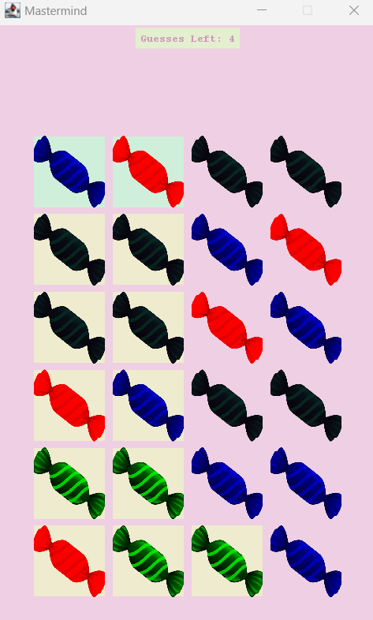
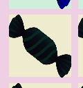

# Mastermind in { Java } 🤹



## Background:

A fun, juggling man from a nearby circus challenges you to a game of guessing. 🤫 Can you guess his secret combination of colors and overcome his silly antics? If so, you are in for a treat! 🍬

## How to play

```
cd bin
java App
```

There are six colors: Red, Green, Blue, Magenta, Orange, and Dark

Press <kbd>R</kbd> on your keyboard to select Red, or <kbd>1</kbd>. Likewise for other colors.

<kbd>Enter</kbd> or <kbd>Space</kbd> to guess

<kbd>Backspace</kbd> to undo

If you see green, that means you got one color placed correctly.


And if you see yellow, that means you found one color in the secret sequence.




<kbd>0</kbd> to reveal the answer

## Credits:
- https://pngtree.com/so/bonbon - candy image
- https://easings.net/ - animation function
- https://www.canva.com/colors/color-wheel/ - colors
- https://en.wikipedia.org/wiki/Golden_ratio - width and height
- https://pixabay.com/ - sounds
- https://www.freeconvert.com/mp3-to-wav
- Richard Dutton (CS professor at Elon University) - project idea